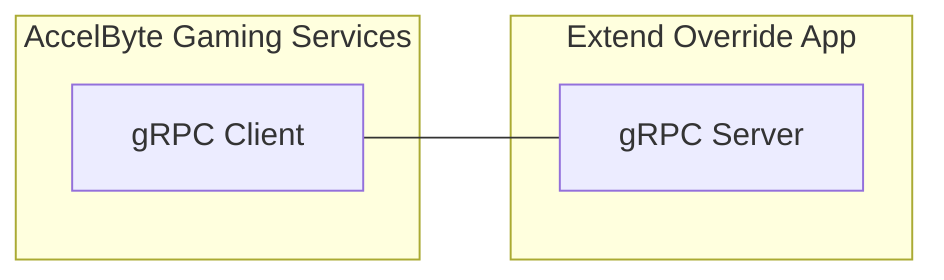

# challenge-assignment-plugin-server-python



`AccelByte Gaming Services` (AGS) features can be customized using 
`Extend Override` apps. An `Extend Override` app is basically a `gRPC server` which 
contains one or more custom functions which can be called by AGS instead of the 
default functions.

## Overview

This repository serves as a template project for an `Extend Override` 
app for `challenge assignment function` written in `C#`. You can clone this repository
and start implementing custom functions which can then be called by AGS.

By using this repository as a template project, you will get the recommended 
authentication and authorization implemented out-of-the-box. You will also get 
some instrumentation for observability so that metrics, traces, and 
logs will be available when the app is deployed.

As an example to get you started, this template project contains sample 
custom functions for connecting this app onto challenge service to be used for challenge assignment.

## Prerequisites

1. Windows 11 WSL2 or Linux Ubuntu 22.04 with the following tools installed.

   a. Bash

      ```
      bash --version

      GNU bash, version 5.1.16(1)-release (x86_64-pc-linux-gnu)
      ...
      ```

   b. Make

      - To install from Ubuntu repository, run: `sudo apt update && sudo apt install make` 

      ```
      make --version

      GNU Make 4.3
      ...
      ```

   c. Docker (Docker Engine v23.0+)

      - To install from Ubuntu repository, run: `sudo apt update && sudo apt install docker.io`
      - Add your user to `docker` group: `sudo usermod -aG docker $USER`
      - Log out and log back in so that the changes take effect

      ```
      docker version

      ...
      Server: Docker Desktop
       Engine:
        Version:          24.0.5
      ...
      ```

   d. Python 3.10

      - On Linux Ubuntu:

         To install from the Ubuntu repository, run `sudo apt update && sudo apt install python3 python3-venv`.

      - On Windows or macOS:

         Use the available installer [here](https://www.python.org/downloads/).

         ```
         python3 --version

         Python 3.10.12
         ```

   e. Curl

      - To install from Ubuntu repository, run: `sudo apt update && sudo apt install curl`

      ```
      curl --version

      curl 7.81.0 (x86_64-pc-linux-gnu)
      ...
      ```

   f. Jq

      - To install from Ubuntu repository, run: `sudo apt update && sudo apt install jq`

      ```
      jq --version

      jq-1.6
      ...
      ```

   g. [Postman](https://www.postman.com/)

      - Use binary available [here](https://www.postman.com/downloads/)

   h. [ngrok](https://ngrok.com/)

      - Follow installation instruction for Linux [here](https://ngrok.com/downloads)

2. Access to AGS environment.

   a. Base URL
   
      - For `Starter` tier e.g.  https://spaceshooter.prod.gamingservices.accelbyte.io
      - For `Premium` tier e.g.  https://dev.accelbyte.io
      
   b. [Create a Game Namespace](https://docs.accelbyte.io/gaming-services/services/access/reference/namespaces/manage-your-namespaces/) if you don't have one yet. Keep the `Namespace ID`.

   c. [Create an OAuth Client](https://docs.accelbyte.io/gaming-services/services/access/authorization/manage-access-control-for-applications/#create-an-iam-client) with confidential client type. Keep the `Client ID` and `Client Secret`.

## Setup

To be able to run this app, you will need to follow these setup steps.

1. Create a docker compose `.env` file by copying the content of 
   [.env.template](.env.template) file.

   > :warning: **The host OS environment variables have higher precedence compared to `.env` file variables**: If the variables in `.env` file do not seem to take 
   effect properly, check if there are host OS environment variables with the 
   same name. See documentation about 
   [docker compose environment variables precedence](https://docs.docker.com/compose/how-tos/environment-variables/envvars-precedence/) 
   for more details.

2. Fill in the required environment variables in `.env` file as shown below.

   ```
   AB_BASE_URL=https://demo.accelbyte.io     # Base URL of AccelByte Gaming Services environment
   AB_CLIENT_ID='xxxxxxxxxx'                 # Client ID from the Prerequisites section
   AB_CLIENT_SECRET='xxxxxxxxxx'             # Client Secret from the Prerequisites section
   AB_NAMESPACE='xxxxxxxxxx'                 # Namespace ID from the Prerequisites section
   PLUGIN_GRPC_SERVER_AUTH_ENABLED=true      # Enable or disable access token validation
   ```

   > :info: **In this sample app, PLUGIN_GRPC_SERVER_AUTH_ENABLED is `true` by default**: If it is set to `false`, th gRPC server can be invoked without an AGS access 
   token. This option is provided for development purpose only. It is 
   recommended to enable `gRPC server` access token validation in production 
   environment.

   For more options, create `src/AccelByte.PluginArch.ChallengeAssignment.Demo.Server/appsettings.Development.json` and fill in the required configuration.

   ```json
   {
      "EnableAuthorization": true,                    // Enable or disable access token and permission check (env var: PLUGIN_GRPC_SERVER_AUTH_ENABLED)
      "RevocationListRefreshPeriod": 60,
      "AccelByte": {
         "BaseUrl": "https://demo.accelbyte.io",      // Base URL (env var: AB_BASE_URL)
         "ClientId": "xxxxxxxxxx",                    // Client ID (env var: AB_CLIENT_ID)    
         "ClientSecret": "xxxxxxxxxx",                // Client Secret (env var: AB_CLIENT_SECRET)
         "AppName": "CHALLENGEASGGRPCSERVICE",
         "TraceIdVersion": "1",
         "Namespace": "xxxxxxxxxx",                   // Namespace ID (env var: AB_NAMESPACE)
         "EnableTraceId": true,
         "EnableUserAgentInfo": true,
         "ResourceName": "CHALLENGEASGGRPCSERVICE"
      }
   }
   ```
   > :warning: **Environment variable values will override related configuration values in this file**.

## Building

To build this app, use the following command.

```
make build
```

## Running

To (build and) run this app in a container, use the following command.

```
docker compose up --build
```

## Testing

### Test in Local Development Environment

> :warning: **To perform the following, make sure PLUGIN_GRPC_SERVER_AUTH_ENABLED is set to `false`**: Otherwise,
the gRPC request will be rejected by the `gRPC server`.

The custom functions in this app can be tested locally using [postman](https://www.postman.com/).

1. Run this app by using the command below.

   ```shell
   docker compose up --build
   ```

2. Open `postman`, create a new `gRPC request`, and enter `localhost:6565` as server URL.

   > :warning: **If you are running [grpc-plugin-dependencies](https://github.com/AccelByte/grpc-plugin-dependencies) stack alongside this app as mentioned in [Test Observability](#test-observability)**: Enter `localhost:10000` instead of `localhost:6565`. This way, the `gRPC server` will be called via `Envoy` service within `grpc-plugin-dependencies` stack instead of directly.

3. Continue by selecting `AssignmentFunction/Assign` method and invoke it with the sample message below.

   a. With a VALID `payload`

      ```json
      {
         "goals": [
            {
                  "code": "goal-code",
                  "challengeCode": "challenge-code",
                  "name": "goal name",
                  "isActive": true,
                  "tags": [
                     {
                        "name": "big goal"
                     }
                  ],
                  "requirements": [
                     {
                        "operator": "AND",
                        "predicates": [
                              {
                                 "parameterName": "mmr",
                                 "parameterType": "STATISTIC",
                                 "matcher": "GREATER_THAN",
                                 "targetValue": 100
                              }
                        ]
                     }
                  ],
                  "rewards": [
                     {
                        "type": "STATISTIC",
                        "itemId": "mmr",
                        "itemName": "more mmr",
                        "quantity": 10
                     }
                  ],
                  "createdAt": {
                     "seconds": "5095510",
                     "nanos": 728418711
                  },
                  "updatedAt": {
                     "seconds": "7873407235",
                     "nanos": -217262300
                  }
            }
         ],
         "namespace": "namespace",
         "userId": "dcd3fc9c238a4c6d9cd8c5da2f595bd6"
   }  
      ```

      The response will be the list of goals chosen to be assigned to user

      ```json
      {
         "assignedGoals":  [
            {
                  "code": "goal-code",
                  "challengeCode": "challenge-code",
                  "name": "goal name",
                  "isActive": true,
                  "tags": [
                     {
                        "name": "big goal"
                     }
                  ],
                  "requirements": [
                     {
                        "operator": "AND",
                        "predicates": [
                              {
                                 "parameterName": "mmr",
                                 "parameterType": "STATISTIC",
                                 "matcher": "GREATER_THAN",
                                 "targetValue": 100
                              }
                        ]
                     }
                  ],
                  "rewards": [
                     {
                        "type": "STATISTIC",
                        "itemId": "mmr",
                        "itemName": "more mmr",
                        "quantity": 10
                     }
                  ],
                  "createdAt": {
                     "seconds": "5095510",
                     "nanos": 728418711
                  },
                  "updatedAt": {
                     "seconds": "7873407235",
                     "nanos": -217262300
                  }
            }
         ],
         "namespace": "namespace",
         "userId": "dcd3fc9c238a4c6d9cd8c5da2f595bd6"
      }
      ```

### Test with AccelByte Gaming Services

For testing this app which is running locally with AGS,
the `gRPC server` needs to be exposed to the internet. To do this without requiring 
public IP, we can use something like [ngrok](https://ngrok.com/).

1. Run this app by using command below.

   ```shell
   docker compose up --build
   ```

2. Sign-in/sign-up to [ngrok](https://ngrok.com/) and get your auth token in `ngrok` dashboard.

3. In this app root directory, run the following helper command to expose `gRPC server` port in local development environment to the internet. Take a note of the `ngrok` forwarding URL e.g. `http://0.tcp.ap.ngrok.io:xxxxx`.

   ```
   make ngrok NGROK_AUTHTOKEN=xxxxxxxxxxx
   ```

   > :warning: **Ngrok free plan has some limitations**: You may want to use paid plan if the traffic is high.

   > :warning: **If you are running [grpc-plugin-dependencies](https://github.com/AccelByte/grpc-plugin-dependencies) stack alongside this app as mentioned in [Test Observability](#test-observability)**: Run the above
   command in `grpc-plugin-dependencies` directory instead of this app directory.
   This way, the `gRPC server` will be called via `Envoy` service within `grpc-plugin-dependencies` stack instead of directly.

4. [Create an OAuth Client](https://docs.accelbyte.io/gaming-services/services/access/authorization/manage-access-control-for-applications/#create-an-iam-client) with `confidential` client type with the following permissions. Keep the `Client ID` and `Client Secret`.
   
   - For AGS Private Cloud customers:
      - `ADMIN:NAMESPACE:{namespace}:CHALLENGE:PLUGIN [CREATE,READ,UPDATE,DELETE]`
      - `NAMESPACE:{namespace}:CHALLENGE:PROGRESSION [READ]`
      - `ADMIN:NAMESPACE:{namespace}:INFORMATION:USER:* [DELETE]`

   - For AGS Shared Cloud customers:
      - Challenge -> Custom Configuration (Read, Create, Update, Delete)
      - Challenge -> Challenge Progression (Read, Create, Update, Delete)
      - IAM -> Users (Delete)

   > :warning: **Oauth Client created in this step is different from the one from Prerequisites section:** It is required by the Postman collection in the next step to register the `gRPC Server` URL and also to create and delete test users.

5. Import the [Postman collection](demo/challenge-assignment-demo.postman_collection.json) in order to simulate the extend app flow. Pay attention to this app console log when extend app flow is running. At least one of the `gRPC Server` methods should get called when you run all the requests in the collection.

### Test Observability

To be able to see the how the observability works in this app locally, there are few things that need be setup before performing tests.

1. Uncomment loki logging driver in [docker-compose.yaml](docker-compose.yaml)

   ```
    # logging:
    #   driver: loki
    #   options:
    #     loki-url: http://host.docker.internal:3100/loki/api/v1/push
    #     mode: non-blocking
    #     max-buffer-size: 4m
    #     loki-retries: "3"
   ```

   > :warning: **Make sure to install docker loki plugin beforehand**: Otherwise,
   this app will not be able to run. This is required so that container logs
   can flow to the `loki` service within `grpc-plugin-dependencies` stack. 
   Use this command to install docker loki plugin: `docker plugin install grafana/loki-docker-driver:latest --alias loki --grant-all-permissions`.

2. Clone and run [grpc-plugin-dependencies](https://github.com/AccelByte/grpc-plugin-dependencies) stack alongside this app. After this, Grafana 
will be accessible at http://localhost:3000.

   ```
   git clone https://github.com/AccelByte/grpc-plugin-dependencies.git
   cd grpc-plugin-dependencies
   docker-compose up
   ```

   > :exclamation: More information about [grpc-plugin-dependencies](https://github.com/AccelByte/grpc-plugin-dependencies) is available [here](https://github.com/AccelByte/grpc-plugin-dependencies/blob/main/README.md).

3. Perform testing. For example, by following [Test in Local Development Environment](#test-in-local-development-environment) or [Test with AccelByte Gaming Services](#test-with-accelbyte-gaming-services).

## Deploying

After done testing, you may want to deploy this app to `AccelByte Gaming Services`.

1. [Create a new Extend Override App on Admin Portal](https://docs.accelbyte.io/gaming-services/services/extend/override/getting-started-with-cloudsave-validator-customization/#create-the-extend-app). Keep the `Repository URI`.

2. Download and setup [extend-helper-cli](https://github.com/AccelByte/extend-helper-cli/) (only if it has not been done previously).

3. Perform docker login with `extend-helper-cli` using the following command.

   ```
   extend-helper-cli dockerlogin --namespace <my-game> --app <my-app> --login
   ```

   > :exclamation: For your convenience, the above `extend-helper-cli` command can also be 
   copied from `Repository Authentication Command` under the corresponding app detail page.

4. Build and push this project docker image to AccelByte ECR using the following command.
   
   ```
   extend-helper-cli image-upload --work-dir <my-project-dir> --namespace <my-game> --app <my-app> --image-tag v0.0.1
   ```

   > :warning: Make sure to perform docker login (step 3) before executing the above command.

5. Open Admin Portal, go to **Extend** -> **Overridable Features**. And then select the extend app.

6. To deploy selected image tag, click **Image Version History** and select 
   desired image tag to be deployed.

7. Click **Deploy Image**, confirm the deployment and go back to App Detail by 
   clicking **Cancel**.

8. Wait until app status is running.

## Next Step

Proceed to create your own `Extend Override` app for `challenge assignment function` by modifying this project. See [here](https://docs.accelbyte.io/gaming-services/services/extend/override/introduction-to-challenge-goals-assignment-customization/) for more details.